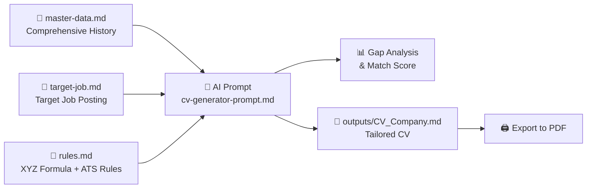

# 🚀 Modular CV Creation & Tailoring System

Welcome to your intelligent workspace designed to create, maintain, and tailor high-impact resumes optimized for **Applicant Tracking Systems (ATS)** and technical recruiters.

---

## 📁 Repository Structure

```text
├── .env                         # Environment variables (API Keys - git ignored)
├── .gitignore                   # Exclusion rules for Git/GitHub
├── README.md                    # Usage guide and workflow
├── package.json                 # Dependencies and execution scripts
├── tsconfig.json                # TypeScript configuration
├── vite.config.ts               # Vite development server and endpoints
├── index.html                   # CV Studio Web interface
├── master-data.md               # 🗂️ Complete career history (SSOT: Projects, metrics, stack)
├── rules.md                     # 📜 Constraints, STAR/XYZ format rules, tone, and ATS guidelines
├── target-job.md                # 🎯 Target job posting you are applying to
├── applications-tracker.md      # 📊 Application log and pipeline status
├── certificates/                # 🏅 Certificates and credentials
│   └── certificates.md
├── prompts/                     # 🤖 Ready-to-use AI prompts
│   ├── cv-generator-prompt.md   # Tailored CV Generator + Gap Analysis
│   ├── cover-letter-prompt.md   # Cover Letter Generator
│   └── interview-prep-prompt.md # Interview Simulator and Preparation
├── templates/                   # 📄 Base templates
│   └── cv-template.md           # Clean Markdown template for export
├── src/                         # 💻 TypeScript + React SSR + Puppeteer Engine
│   ├── app/                     # CV Studio Web UI
│   ├── cli/                     # CLI for export and tailoring
│   ├── components/              # Visual CV rendering
│   ├── core/                    # Core engines (Puppeteer, Gemini API, Parser, Audit)
│   ├── themes/                  # Professional CSS themes
│   └── types/                   # CV data types
└── outputs/                     # 📤 Tailored CVs and reports generated per application
    └── CV_Daniel_Corredor_Acosta_Addi.md
```

---

## ⚡ Step-by-Step Workflow



### Step 1: Configure `master-data.md` (One-time setup, update periodically)
Populate [master-data.md](file:///c:/Users/LeGo/Documents/customs%20CVs/master-data.md) with **all** your professional experience, projects, metrics, tools, and certifications. This file is never sent directly to an employer—it is your private Single Source of Truth (SSOT) from which the AI extracts the most relevant highlights.

### Step 2: Paste the Job Vacancy into `target-job.md`
Whenever you find an attractive position on LinkedIn, Indeed, Ashby, etc., open [target-job.md](file:///c:/Users/LeGo/Documents/customs%20CVs/target-job.md) and paste the job description and requirements.

### Step 3: Run AI Generation
1. Open [cv-generator-prompt.md](file:///c:/Users/LeGo/Documents/customs%20CVs/prompts/cv-generator-prompt.md).
2. Prompt your AI assistant (Claude, ChatGPT, Gemini, or Antigravity):
   > *"Read `rules.md`, `master-data.md`, and `target-job.md`, then generate the Gap Analysis report and the tailored CV, saving them to `outputs/CV_[Company]_[Role].md`"*.

### Step 4: Automated Local PDF Export (Zero token cost)

The project includes a modular engine built with **TypeScript + React SSR + Puppeteer** featuring 4 professional design themes:

```bash
# Export the most recent CV in outputs/ to PDF
npm run pdf

# Export with specific themes:
npm run pdf:modern       # Modern Tech theme (Stripe/Linear style with badges)
npm run pdf:executive    # Executive Classic theme (Corporate Navy / Serif)
npm run pdf:ats          # Minimal ATS theme (100% parseable by legacy ATS filters)
npm run pdf:two-column   # Two-Column theme (Sidebar + Main Content)

# Export all Markdown files in outputs/ to PDF
npm run pdf:all
```

---

## 🎨 CV Studio Web (Vite + React + Hot Reload)

To preview your CV interactively in the browser with sub-50ms Hot Module Reloading, inspect metrics, and switch themes on the fly:

```bash
npm run dev
```
Open your browser at `http://localhost:5173`.

---

## 🤖 Automated Generation with Gemini API (Optional)

If you want the AI to automatically tailor your CV directly from the CLI using `master-data.md` and `target-job.md`:
1. Create a `.env` file in the project root with your API Key:
   ```env
   GEMINI_API_KEY=your_api_key_here
   ```
2. Run the command specifying the target company:
   ```bash
   npm run generate "Stripe"
   ```
   > 🔒 **SSOT Guarantee:** `master-data.md` is **100% read-only and immutable**. The AI will never modify it; it only queries your real data to produce `outputs/CV_Stripe.md` and `outputs/CV_Stripe.pdf`.
