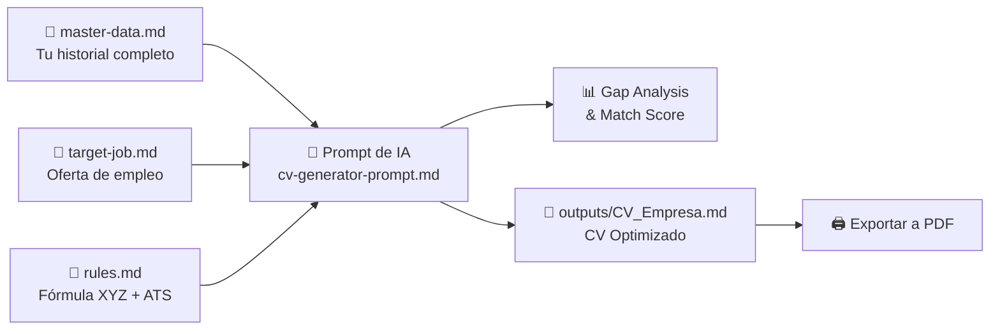

# 🚀 Sistema Modular de Creación y Personalización de CVs

Bienvenido a tu entorno de trabajo inteligente para crear, mantener y personalizar currículums de alto impacto optimizados para **ATS (Applicant Tracking Systems)** y reclutadores técnicos.

---

## 📁 Estructura del Repositorio

```text
├── .env                         # Variables de entorno (API Keys - git ignored)
├── .gitignore                   # Reglas de exclusión para Git/GitHub
├── README.md                    # Guía de uso y flujo de trabajo
├── package.json                 # Dependencias y scripts de ejecución
├── tsconfig.json                # Configuración TypeScript
├── vite.config.ts               # Servidor de desarrollo Vite y endpoints
├── index.html                   # Interfaz de CV Studio Web
├── master-data.md               # 🗂️ Tu trayectoria completa (SSOT: Proyectos, métricas, stack)
├── rules.md                     # 📜 Límites, reglas de formato STAR/XYZ, tono y normas ATS
├── target-job.md                # 🎯 Oferta laboral objetivo a la que postulas
├── applications-tracker.md      # 📊 Registro y estado de postulaciones
├── certificates/                # 🏅 Certificados y credenciales
│   └── certificates.md
├── prompts/                     # 🤖 Prompts listos para usar con IA
│   ├── cv-generator-prompt.md   # Generador de CV + Gap Analysis
│   ├── cover-letter-prompt.md   # Generador de Carta de Presentación
│   └── interview-prep-prompt.md # Preguntas y preparación para entrevistas
├── templates/                   # 📄 Plantillas base
│   └── cv-template.md           # Plantilla Markdown limpia para exportación
├── src/                         # 💻 Motor TypeScript + React + Puppeteer
│   ├── app/                     # CV Studio Web UI
│   ├── cli/                     # CLI de exportación y tailoring
│   ├── components/              # Renderizado visual del CV
│   ├── core/                    # Motores (Puppeteer, Gemini API, Parser)
│   ├── themes/                  # Temas CSS profesionales
│   └── types/                   # Tipos de datos del CV
└── outputs/                     # 📤 CVs personalizados generados por cada postulación
    └── Ejemplo_CV_Tailored_Stripe.md
```

---

## ⚡ Flujo de Trabajo (Workflow Paso a Paso)



### Paso 1: Configura tu `master-data.md` (Solo una vez y actualízalo periódicamente)
Llena [master-data.md](file:///c:/Users/LeGo/Documents/customs%20CVs/master-data.md) con **toda** tu experiencia laboral, proyectos, métricas, herramientas y certificaciones. Este archivo nunca se envía a una empresa: es tu almacén de datos donde la IA extraerá lo más valioso.

### Paso 2: Copia la vacante en `target-job.md`
Cada vez que encuentres una oferta interesante en LinkedIn, Indeed, etc., abre [target-job.md](file:///c:/Users/LeGo/Documents/customs%20CVs/target-job.md) y pega el texto de la oferta.

### Paso 3: Ejecuta la Generación con IA
1. Abre [cv-generator-prompt.md](file:///c:/Users/LeGo/Documents/customs%20CVs/prompts/cv-generator-prompt.md).
2. Pídele al asistente de IA (ChatGPT, Claude, Gemini o tu agente Antigravity):
   > *"Lee `rules.md`, `master-data.md` y `target-job.md` y genera el reporte de Gap Analysis y el CV optimizado guardándolo en `outputs/CV_[Empresa]_[Cargo].md`"*.

### Paso 4: Exportación y Diseño Automatizado a PDF (Local y sin costo de tokens)

El proyecto cuenta con un motor modular en **TypeScript + React SSR + Puppeteer** con 4 temas de diseño profesional:

```bash
# Exportar el CV más reciente en outputs/ a PDF
npm run pdf

# Exportar con temas específicos:
npm run pdf:modern       # Tema Modern Tech (Estilo Stripe/Linear con badges)
npm run pdf:executive    # Tema Executive Classic (Corporate Navy/Serif)
npm run pdf:ats          # Tema Minimal ATS (100% compatible con filtros ATS)
npm run pdf:two-column   # Tema Two-Column (Barra lateral + contenido)

# Exportar todos los archivos Markdown de outputs/ a PDF
npm run pdf:all
```

---

## 🎨 CV Studio Web (Vite + React + Hot Reload)

Para previsualizar tu CV interactivamente en el navegador con Hot Module Reloading (<50ms), inspeccionar métricas y cambiar de tema en caliente:

```bash
npm run dev
```
Abre tu navegador en `http://localhost:5173`.

---

## 🤖 Generación Automática con Gemini API (Opcional)

Si deseas que la IA adapte automáticamente tu CV leyendo `master-data.md` y `target-job.md`:
1. Crea un archivo `.env` en la raíz del proyecto con tu API Key:
   ```env
   GEMINI_API_KEY=tu_api_key_aqui
   ```
2. Ejecuta el comando indicando el nombre de la empresa:
   ```bash
   npm run generate "Stripe"
   ```
   > 🔒 **Garantía SSOT:** `master-data.md` es **100% intocable y de solo lectura**. La IA nunca lo modificará; únicamente consultará tus datos reales para generar `outputs/CV_Stripe.md` y `outputs/CV_Stripe.pdf`.


