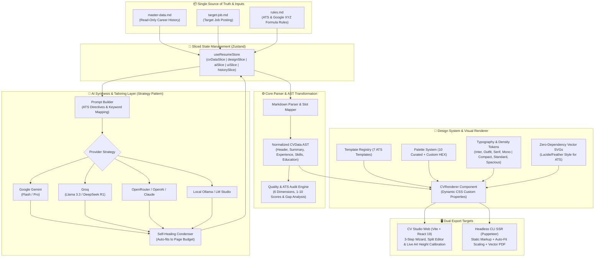

# 🚀 CV Studio & Tailor Engine (v2.0)

> **Multiply your interviews by tailoring your resume in seconds.** An intelligent, privacy-first ATS resume studio designed to tailor career histories to target job descriptions with quantifiable Google XYZ-formula bullets, real-time quality audits, and pixel-perfect 1-page PDF exports.

Designed to produce high-impact, pixel-perfect CVs optimized for **Applicant Tracking Systems (ATS)**, executive recruiters, and modern hiring managers. Built with **TypeScript**, **React 19**, **MUI 9**, **Vite**, **Puppeteer**, and **Multi-Provider AI Strategies**.

---

## 🏛️ System Architecture

The engine is engineered around strict software design principles (**SOLID**, **DRY**, **Separation of Concerns**) and decoupling:



---

### Architectural Pillars

1. **Immutable Single Source of Truth (SSOT):**
   * [`master-data.md`](file:///c:/Users/LeGo/Documents/customs%20CVs/master-data.md) is **strictly read-only**.
   * The AI engines and CLI never overwrite your career history. Every application produces an isolated, versioned artifact in `outputs/` (e.g. `outputs/CV_Jane_Doe_Stripe.md` and `outputs/CV_Jane_Doe_Stripe.pdf`).

2. **Dual-Engine Architecture (Frontend Studio + Headless CLI):**
   * **Browser Studio ([src/components/studio/](file:///c:/Users/LeGo/Documents/customs%20CVs/src/components/studio/)):** Interactive Vite + React 19 SPA featuring a 3-step guided wizard, side-by-side markdown comparison, real-time A4 height measurement, live page boundary indicator, quality audit drawer, and non-intrusive floating toasts.
   * **Headless Node Engine ([src/core/pdf-generator.ts](file:///c:/Users/LeGo/Documents/customs%20CVs/src/core/pdf-generator.ts)):** Server-side rendering using `renderToStaticMarkup` without browser overhead, driving headless Puppeteer to generate print-calibrated A4 vector PDFs with sub-millimeter margins.

3. **100% Parity Between CLI and UI:**
   * Any visual style configurable in the web studio (template layout, color palette, custom brand HEX, font family, spacing density, and page budget) is fully configurable via CLI arguments or package commands.

4. **Slot-Based Template System (Open/Closed Principle):**
   * Layout templates decouple structure from presentation. CV data is parsed into normalized slots (`HeaderSlot`, `SummarySlot`, `ExperienceSlot`, `EducationSlot`, `SkillsSlot`).
   * Adding a new layout only requires implementing a layout component without touching existing templates or data parsers.

5. **Deterministic Vector SVGs for ATS & Puppeteer:**
   * Instead of heavy external icon fonts or Emotion CSS-in-JS wrappers, contact icons ([src/components/Icons.tsx](file:///c:/Users/LeGo/Documents/customs%20CVs/src/components/Icons.tsx)) are pure geometric SVGs with zero runtime dependencies. They render identically in Node SSR, Puppeteer, and web browsers with zero styling artifacts.

6. **Self-Healing AI Condensation Loop:**
   * If a generated resume slightly overshoots the requested page budget (e.g. 1.15 pages for a 1-page target), the engine automatically executes a precision condensation pass using the Google XYZ formula before finalizing the PDF.

7. **Centralized Design System & Tokens:**
   * Colors, dimensions, and typography are managed via a single source of truth in [src/theme/](file:///c:/Users/LeGo/Documents/customs%20CVs/src/theme/), feeding both MUI themes and `:root` CSS custom properties with native Dark/Light mode support.

---

## 📁 Project Directory Structure

```text
├── master-data.md               # 🗂️ Complete career history (SSOT: Projects, metrics, stack)
├── rules.md                     # 📜 ATS rules, STAR/Google XYZ formula, and writing guidelines
├── target-job.md                # 🎯 Active job posting requirements and company details
├── applications-tracker.md      # 📊 Pipeline tracking for active job applications
├── outputs/                     # 📤 Generated tailored CVs, Gap Reports, and vector PDFs
├── prompts/                     # 🤖 Standalone AI prompt templates
├── src/
│   ├── app/                     # Main Application root & layout orchestrator (App.tsx)
│   ├── cli/                     # CLI orchestrator and interactive wizard (index.ts, commands)
│   ├── components/              # Universal React components (CVRenderer, Icons, Slots)
│   │   ├── landing/             # Welcome & Onboarding view
│   │   ├── slots/               # Reusable atomic CV content slots (Header, Experience, etc.)
│   │   └── studio/              # CV Studio Web UI
│   │       ├── ai/              # Quick AI configuration & model testing modals
│   │       ├── audit/           # Quality audit cards & interactive improvement modals
│   │       ├── history/         # Application versions & history browser
│   │       ├── preview/         # Preview toolbar, nav rail, side panels & audit drawer
│   │       ├── profile/         # Master data form & profile inspector
│   │       ├── settings/        # AI credentials, synthesis rules & community credits
│   │       └── tailor/          # AI model selector & page budget selector
│   ├── constants/               # Curated palettes, typography tokens, and project links
│   ├── core/                    # Core business logic & services
│   │   ├── ai/                  # AI Strategy pattern, prompt builder & auto-condenser
│   │   ├── parser/              # Markdown AST parser, serializer & slot mapper
│   │   ├── audit-engine.ts      # 6-dimension quality & ATS audit evaluator
│   │   ├── pdf-generator.ts     # React SSR -> Puppeteer vector PDF compiler
│   │   └── workspace.ts         # Path resolution and workspace discovery
│   ├── hooks/                   # Custom stateful hooks (useGitHubStarPrompt, useAuditActions, etc.)
│   ├── store/                   # Sliced Zustand store (cvData, design, ai, ui, history)
│   ├── styles/                  # Clean vanilla CSS modules (tokens, preview, print, audit)
│   ├── templates/               # 7 Professional CV visual templates & template registry
│   ├── theme/                   # Centralized design tokens (colors, dimensions, MUI theme)
│   ├── themes/                  # Universal CSS stylesheets for the 7 templates
│   └── types/                   # TypeScript interfaces & shared domain types
├── index.html                   # CV Studio Web entry point
├── package.json                 # Scripts and dependency declarations
└── vite.config.ts               # Vite server configuration
```

---

## ⚡ Quick Start & Common Commands

### 0. 🧙‍♂️ Interactive Terminal Wizard (No Flags Needed!)
For a guided CLI experience without memorizing flags:
```bash
npm run wizard
# or
npm run cli
```
Guides you through:
* Selecting markdown CVs from `outputs/` via numbered choices.
* Choosing from the 7 visual templates and 10 color palettes.
* Calibrating typography, spacing density, and page budget.
* Tailoring resumes with AI or running Quality & ATS audits.

---

### 1. Interactive Studio Web UI
Start the real-time visual studio with Hot Module Reloading (HMR):
```bash
npm run dev
```
Open [http://localhost:5173](http://localhost:5173) to preview templates, test color palettes, and edit markdown in real time.

---

### 2. Inspect Available Design Options (Discovery)
Query the engine's built-in catalogs directly from the terminal:
```bash
npm run themes      # List all 7 visual layout templates with target roles
npm run palettes    # List all 10 curated color schemes with primary HEX codes
npm run models      # List all 15 supported AI models and providers
```

---

### 3. Compile PDFs via CLI (`npm run pdf`)

```bash
# Export the most recently generated or edited CV in outputs/ to PDF
npm run pdf

# Export a specific CV file
npm run pdf outputs/CV_Jane_Doe_Stripe.md

# Export using a specific visual theme
npm run pdf outputs/CV_Jane_Doe_Stripe.md -- --theme executive
npm run pdf outputs/CV_Jane_Doe_Stripe.md -- --theme designer-uiux
npm run pdf outputs/CV_Jane_Doe_Stripe.md -- --theme two-column
npm run pdf outputs/CV_Jane_Doe_Stripe.md -- --theme minimal-ats

# Batch-compile all Markdown files in outputs/ to PDF
npm run pdf:all
```

#### Full Design Parity Flags

Combine flags freely to customize typography, branding, and density:

```bash
# Example 1: Executive styling with custom corporate navy palette & serif typography
npm run pdf outputs/CV_Lead.md -- --theme executive --palette corporate-blue --font serif --density standard --pages 1

# Example 2: Modern tech resume with linear indigo accent & compact spacing
npm run pdf outputs/CV_Dev.md -- --theme modern-tech --palette modern-indigo --font outfit --density compact --pages 1

# Example 3: Custom brand HEX color override
npm run pdf outputs/CV_Dev.md -- --theme designer-uiux --color "#0f766e" --font outfit

# Example 4: Strict ATS-optimized monochrome export
npm run pdf outputs/CV_Corporate.md -- --theme minimal-ats --palette editorial-black --pages 1
```

---

### 4. AI Tailoring & Synthesis (`npm run generate` / `npm run tailor`)

Tailor your resume against `target-job.md` using Gemini API or custom endpoints:

```bash
# Standard tailoring using default settings
npm run generate "Stripe"

# Tailoring with full design parameters and 1-page budget constraint
npm run generate "Google" -- --theme modern-tech --palette modern-indigo --pages 1

# Tailoring with custom job posting and master data files
npm run generate "Amazon" -- --job custom-job.md --master my-profile.md --theme executive --pages 2
```

---

### 5. Automated Quality & ATS Audit (`npm run audit`)

Evaluates the CV against technical recruiter standards, Google XYZ formula, action verbs, and keyword coverage:

```bash
npm run audit outputs/CV_Jane_Doe_Stripe.md
```
Generates:
* `outputs/Quality_Report_[Name]_[Company].md` (1-10 table across 6 core dimensions)
* `outputs/Quality_Report_[Name]_[Company].pdf` (Printable executive audit summary)

---

## 🎨 Visual Themes Reference (7)

| Theme ID | Category | Layout | Recommended For | Description |
| :--- | :--- | :--- | :--- | :--- |
| `modern-tech` | Tech & Engineering | Single Column | Software Engineers, Cloud/DevOps, Tech Leads | Stripe/Linear inspired style with monospace badges & dense stack |
| `executive` | Leadership | Two Column (Banner) | C-Level, VPs, Directors, Management Consultants | Corporate Navy top banner with initials monogram box |
| `minimal-ats` | Universal ATS | ATS Linear | Workday, Taleo, Greenhouse enterprise screening | Zero-distraction linear monochrome for 100% parser accuracy |
| `two-column` | General Tech | Two Column (Sidebar) | Full-Stack Devs, Architects, Technical Leaders | High-contrast right sidebar with geometric monogram card |
| `designer-uiux` | Creative & Product | Two Column (Pastel) | Product Designers, UI/UX Specialists, Frontend Devs | Soft tinted card header with editorial asymmetric flow |
| `formal-legal` | Legal & Finance | Single Column (Serif) | Attorneys, Corporate Counsel, Investment Bankers | Prestigious classical serif typography and formal division rules |
| `academic-research` | Science & R&D | Two Column (Dual-Tone)| Research Scientists, PhDs, Engineering Managers | Dark charcoal sidebar with avatar badge and research layout |

---

## 🌈 Curated Color Palettes Reference (10)

All palettes are calibrated for **WCAG AA contrast** and ensure body copy remains deep charcoal/black (`#0f172a` / `#1e293b`) for 100% ATS readability:

| Palette ID | Primary HEX | Best Suited Industry / Vibe |
| :--- | :--- | :--- |
| `corporate-blue` | `#2563eb` | Tech, Enterprise, Engineering, Cloud & Security |
| `accent-teal` | `#0d9488` | Fintech, Product Management, Growth & High-growth Startups |
| `editorial-black` | `#0f172a` | High-contrast monochrome, timeless, executive & 100% ATS clean |
| `minimal-slate` | `#64748b` | Refined cool steel neutral grey for minimalist technical roles |
| `modern-indigo` | `#6366f1` | Linear / Stripe inspired electric accent for modern SaaS |
| `executive-burgundy`| `#9f1239` | Leadership, Corporate Strategy, Private Equity & Legal |
| `forest-green` | `#16a34a` | Climate tech, Sustainability, Life Sciences & Healthcare |
| `warm-amber` | `#d97706` | Client Success, Operations, Media, Consulting & Architecture |
| `creative-coral` | `#ea580c` | UI/UX Design, Content Strategy & Consumer Product teams |
| `custom` | `--color "#HEX"` | Any bespoke company brand color passed via CLI or UI |

---

## 🔤 Typography & Spacing Density Options

* **Font Families (`--font`):**
  * `inter`: Clean, high-readability sans-serif optimized for screens and ATS readers (Default).
  * `outfit`: Contemporary geometric sans-serif for modern tech aesthetics.
  * `serif`: Formal Merriweather / EB Garamond for executive, legal, and academic resumes.
  * `mono`: Technical JetBrains Mono accent for dev-heavy resumes.
* **Spacing Density (`--density`):**
  * `compact`: Tight margins and line heights (8.8pt font) — perfect for fitting dense content onto exactly 1 page.
  * `standard`: Balanced rhythm and readability (9.5pt font) — industry standard (Default).
  * `spacious`: Relaxed margins (10.2pt font) — recommended for 2-page executive profiles.

---

## 🤖 IDE Assistant Pairing Workflow (Zero Token Cost)

If you are using an AI-assisted IDE (like **Google Antigravity**, Cursor, or VS Code with Claude/Gemini):

1. **Configure Job:** Paste the vacancy requirements into [`target-job.md`](file:///c:/Users/LeGo/Documents/customs%20CVs/target-job.md).
2. **Prompt the IDE Assistant:** In your IDE chat, simply ask:
   > *"Read `rules.md`, `master-data.md`, and `target-job.md`. Tailor my resume for Stripe into 1 page and save it to `outputs/CV_Daniel_Corredor_Acosta_Stripe.md`"*.
3. **Compile via CLI with your preferred style:**
   ```bash
   npm run pdf outputs/CV_Daniel_Corredor_Acosta_Stripe.md -- --theme modern-tech --palette modern-indigo --pages 1
   ```
4. **Preview in Real Time:** Open `npm run dev` or inspect the generated PDF in `outputs/`.

This workflow gives you **unlimited tokens**, **deep reasoning capability**, and **zero API billing costs** while utilizing the engine's compilation, formatting, and auto-fitting capabilities.

---

## 🌐 Cloud Deployment (Vercel)

The CV Studio frontend is production-ready for deployment on **Vercel** with zero server costs:

1. Push your repository to GitHub (keep it **Private**).
2. Go to [Vercel Dashboard](https://vercel.com) and click **"Add New Project"**.
3. Select this repository. Vercel automatically detects the preset from [`vercel.json`](file:///c:/Users/LeGo/Documents/customs%20CVs/vercel.json):
   * **Framework Preset:** Vite
   * **Build Command:** `npm run build`
   * **Output Directory:** `dist`
4. Click **Deploy**. Your studio will be live with instant sub-second global CDN delivery and automatic branch previews.

---

## 📦 Publishing the CLI to NPM (Protected Source)

You can distribute the CLI tool publicly on npm without exposing your private GitHub repository:

1. Build the standalone minified bundle:
   ```bash
   npm run build:cli
   ```
   Compiles the entire TypeScript CLI into a single, minified ~95KB bundle in `bin/cli.mjs`.
2. Publish to npm:
   ```bash
   npm publish --access public
   ```
   *[`..npmignore`](file:///c:/Users/LeGo/Documents/customs%20CVs/.npmignore) strictly blocks `src/`, `master-data.md`, `target-job.md`, `.env`, and git configs, publishing only the compiled binary and themes.*

---

## 🛡️ Quality & Verification

Verify the entire codebase anytime using TypeScript's strict type checker:
```bash
npm run typecheck
```
Build the production web bundle:
```bash
npm run build
```

---

## 📄 License
MIT License. Built for engineers and leaders crafting bespoke career narratives.
