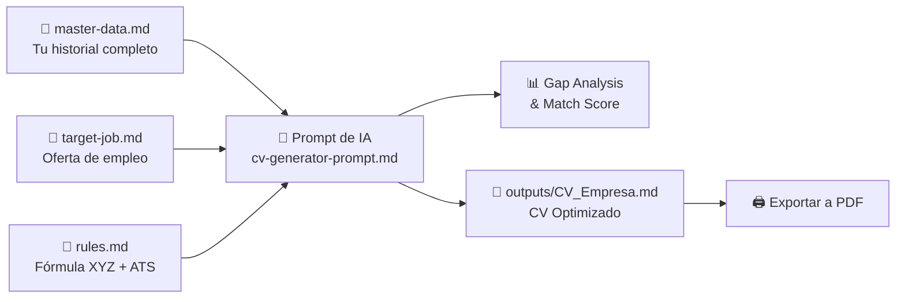

# 🚀 Sistema Modular de Creación y Personalización de CVs

Bienvenido a tu entorno de trabajo inteligente para crear, mantener y personalizar currículums de alto impacto optimizados para **ATS (Applicant Tracking Systems)** y reclutadores técnicos.

---

## 📁 Estructura del Workspace

```text
mi-cv-workspace/
├── rules.md                     # 📜 Límites, reglas de formato STAR/XYZ, tono y normas ATS
├── master-data.md               # 🗂️ Tu trayectoria completa (SSOT: Proyectos, métricas, stack)
├── target-job.md                # 🎯 Oferta laboral objetivo a la que postulas
├── README.md                    # 📖 Guía de uso, flujo de trabajo y sugerencias
├── prompts/                     # 🤖 Prompts listos para usar con IA
│   ├── cv-generator-prompt.md   # Generador de CV + Gap Analysis
│   └── cover-letter-prompt.md   # Generador de Carta de Presentación
├── templates/                   # 📄 Plantillas base
│   └── cv-template.md           # Plantilla Markdown limpia para exportación
└── outputs/                     # 📤 CVs personalizados generados por cada postulación
    └── Ejemplo_CV_Tailored_Stripe.md
```

---

## ⚡ Flujo de Trabajo (Workflow Paso a Paso)



### Paso 1: Configura tu `master-data.md` (Solo una vez y actualízalo periódicamente)
Llena [master-data.md](file:///c:/Users/LeGo/Documents/customs%20CVs/mi-cv-workspace/master-data.md) con **toda** tu experiencia laboral, proyectos, métricas, herramientas y certificaciones. Este archivo nunca se envía a una empresa: es tu almacén de datos donde la IA extraerá lo más valioso.

### Paso 2: Copia la vacante en `target-job.md`
Cada vez que encuentres una oferta interesante en LinkedIn, Indeed, etc., abre [target-job.md](file:///c:/Users/LeGo/Documents/customs%20CVs/mi-cv-workspace/target-job.md) y pega el texto de la oferta.

### Paso 3: Ejecuta la Generación con IA
1. Abre [cv-generator-prompt.md](file:///c:/Users/LeGo/Documents/customs%20CVs/mi-cv-workspace/prompts/cv-generator-prompt.md).
2. Pídele al asistente de IA (ChatGPT, Claude, Gemini o tu agente Antigravity):
   > *"Lee `rules.md`, `master-data.md` y `target-job.md` y genera el reporte de Gap Analysis y el CV optimizado guardándolo en `outputs/CV_[Empresa]_[Cargo].md`"*.

### Paso 4: Exportación a PDF
Puedes exportar tus archivos Markdown a PDF usando:
- **VS Code Extension:** *Markdown PDF* (o *Marp for VS Code*).
- **Herramientas CLI:** `pandoc`, `wkhtmltopdf` o abrir en navegador y presionar `Ctrl + P` (Imprimir como PDF).

---

## 💡 Sugerencias y Mejoras para Llevar este Sistema al Siguiente Nivel

### 1. 🗂️ Registro de Postulaciones (Application Tracker)
Crea un archivo `applications-tracker.md` o una tabla con:
- Fecha de postulación.
- Empresa, cargo y enlace.
- CV personalizado utilizado (enlace en `outputs/`).
- Estado actual (*Postulado / Primera entrevista / Prueba técnica / Oferta / Rechazado*).
- Salario conversado y feedback recibido.

### 2. 🌐 Soporte Multilingüe Automatizado
- Mantener una versión `master-data-en.md` y `master-data-es.md` (o dejar que el prompt maestro traduzca y adapte la terminología de forma nativa).

### 3. 🎯 Matriz de Habilidades por Especialidad (Sub-perfiles)
Si aplicas a roles diferentes (ej. *Frontend Lead* vs *Fullstack Engineer* vs *DevOps Engineer*), añade secciones especializadas en `master-data.md` para que la IA priorice el ángulo correcto.

### 4. 🧪 Simulador de Entrevista Técnica / Preguntas Clave
Añadir un prompt `prompts/interview-prep-prompt.md` que, leyendo `target-job.md` y tu CV generado, cree:
- Las 10 preguntas técnicas y situacionales más probables que te harán en la entrevista.
- Respuestas modelo basadas en tus proyectos reales de `master-data.md` usando STAR.

### 5. 🤖 Script de Automatización
Crear un pequeño script en Python o Node.js que:
- Tome los archivos Markdown.
- Llame a la API de un LLM.
- Convierta automáticamente el Markdown resultante a un PDF con estilo tipográfico impecable.
